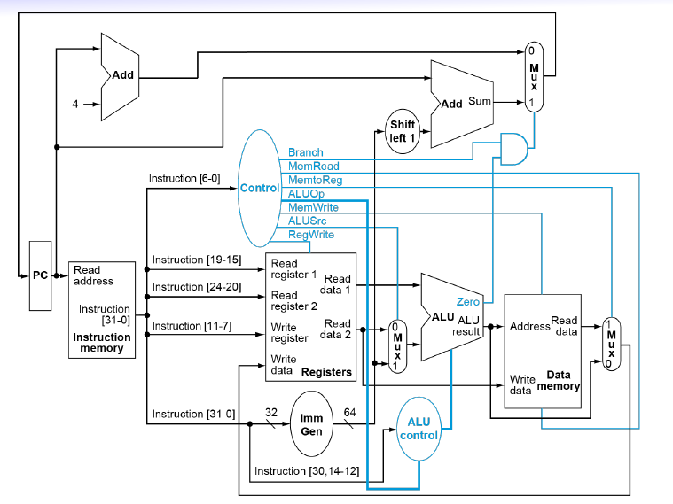

# Single cycle CPU

## How to execute an instruction

### Instruction Fetch (IF)

- Fetches the instruction pointed to by PC from instruction memory

!!! note

    Also calculates PC + 4 for the next instruction (PC + $x$) where $x$ is the size (in bytes) of current instruction

### Instruction Decode (ID)

- Decode and **read register operands (rs2, rs1)**

### Execute (EX)

- Execute according to instruction type

### Memory Reference (MEM)

- **Memory access** 

!!! note

    For instruction `sd`, it will store `rs2` to memory and *write PC + 4* into PC

### Register Write Back (WB)

- **Write register back to RF and PC** 

## Components

- [ALU](./alu.md)
- PC: Program counter, points to the next instruction to be executed
- Adder: increments or decrements the PC
- Register file: where the registers live
- Instruction memory: stores instructions 啊不然勒
- Data memory: stores data 啊不然勒
- Control signals: control behaviour of ALU and read write paths
- Sign extension unit: ALU needs unsigned 32 bit numbers, whether to do subtraction is controlled by ALUOp

## Control Signals

- `Branch`
- `MemRead`
- `MemtoReg`
- `ALUOp`
- `MemWrite`
- `ALUSrc`
- `RegWrite`

!!! note "RISC-V and MIPS architecture difference"

    MIPS: needs additional `RegDst` control signal to indicate which register to write to

    * R-type: the destination is called `rd`
    * I-type: the destination is called `rt`

## Combinational / Sequential Circuit

