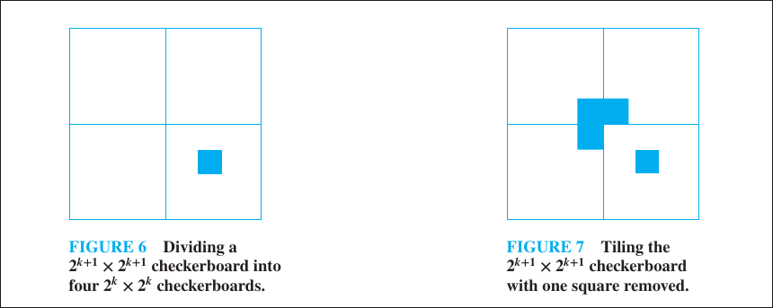

# Mathematical induction

## Well Ordering Principle of the Natural Numbers

!!! definition "The Well Ordering Principle of the Natural Numbers"

    All nonempty subsets of $\mathbb{N}$ has a minimal element.

> It is an axiom.

## Mathematical Induction and its Stronger Version

!!! definition "Mathematical Induction"
    
    Let $S$ be a subset of $\mathbb{N}$. If $S$ satisfies
    
    1. $1\in S$
    2. $n\in S$ implies $n+1\in S$

    then $S=\mathbb{N}$.

!!! definition "Strong Mathematical Induction"
    
    Let $S$ be a subset of $\mathbb{N}$. If $S$ satisfies
    
    1. $1\in S$
    2. $\{1,2,\dots,n\}\subset S$ implies $n+1\in S$

    then $S=\mathbb{N}$.

## The Well Ordering Principle is equivalent to Mathematical Induction

???+ theorem

    TFAE

    1. Mathematical Induction
    2. Strong Mathematical Induction
    3. The Well Ordering Principle

??? abstract "Proof"

    1. and 2. are trivially equivalent, so we prove 2. and 3. are equivalent.

    !!! note "2. $\implies$ 3."
        Assume Strong Mathematical Induction is true. Suppose that $S\subset\mathbb{N}$ is a nonempty set that contains no minimal element, then $1\not\in S$, i.e., if we let $S':=\mathbb{N}-S$, then $1\in S'$.

        If $\{1,2,\dots,n\}\subset S'$ and $n+1\not\in S'$, i.e., $\{1,2,\dots,n\}\not\in S$ and $n+1\in S$, then $n+1$ is the minimal element of $S$, which contradicts the assumption.

        Therefore if $\{1,2,\dots,n\}\subset S'$ then $n+1\in S'$. By the Strong Mathematical Induction, $S'=\mathbb{N}$, so $S'=\mathbb{N}=\mathbb{N}-S$ implies $S$ is empty, also contradicts the assumption. Hence Strong Mathematical induction implies the Well Ordering Principle.

    !!! note "3. $\implies$ 2."

        Assume the Well Ordering Principle is true. Let $S$ be a subset of $\mathbb{N}$ such that, $1\in S$, and that $\{1,2,\dots,n\}\subset S$ implies $n+1\in S$.

        Suppose that $S\neq\mathbb{N}$, i.e., $S':=\mathbb{N}-S$ is not empty, then there is a minimal element in $S'$, say $k\in S'$. Because $1\in S$, $k\neq 1$ so $k\ge 2$. This means $\{1,2,\dots,k-1\}\subset S$ and by the assumption, $k\in S$, so $k\in S'\cap S=\varnothing\rightarrow\leftarrow$. Thus $S=\mathbb{N}$, i.e., Strong Mathematical Induction is true if the Well Ordering Principle is true.

## Mathematical Induction Problems

!!! problem "Routine practices"

    Use Mathematical Induction or Strong Mathematical Induction to prove the following statements

    1. $\left(\sum_{k=1}^{n}k\right)^2=\sum_{k=1}^{n}k^3$
    2. $3|(7^n-4^n)$
    3. $n^2+(n+1)^2+(n+2)^2+(n+3)^2$ is not divisble by $8$
    4. $\displaystyle\sum_{k=1}^{n}\cos{(kx)}=\frac{\cos{((n+1)(x/2))}\sin(nx/2)}{\sin(x/2)}$ if $\sin{(x/2)}\neq0$
    

### Recursive Relation Conjecture proofs

!!! problem "Recursive relation conjecture"
    
    Use Strong Mathematical Induction to prove the Binet's Formula for Fibonacci numbers

    $$
    F_n=\frac{1}{\sqrt{5}}\left(\left(\frac{1+\sqrt{5}}{2}\right)^n-\left(\frac{1-\sqrt{5}}{2}\right)^n\right)
    $$

    ---

    Let $a_n$ be recursively defined by

    $$
    \begin{cases}
    a_0=1,a_1=2\\
    a_n=\frac{a_{n-1}^2}{a_{n-2}},n\ge2
    \end{cases}
    $$

    Conjecture a formula for $a_n$.
    
    ??? abstract "Proof"
        
        Claim: $a_n=2^{n}$.

        Clearly for $n=0$ and $n=1$ the claim holds.

        If $n=2$, then $a_2=2^2/1=2^2$ so $n=2$ holds.
        
        Assume that for $\{0,1,2,\dots,k\}$ with $k\ge 2$, $a_k=2^k$.

        For $k+1\ge 3$, we have

        $$
        a_{k+1}=\frac{a_{k}^2}{a_{k-1}}=2^{2k-k+1}=2^{k+1}
        $$

        Therefore by Strong Mathematical Induction the claim holds.
        
    ---

    Let $N\in\mathbb{N}$. Given a $2^N\times 2^N$ grid, after covering exactly one square, prove that it can be filled with L-shaped triominos.

    ??? abstract "Proof"
        
        $2\times 2$ grid with one square removed clearly can be filled with L-shaped triominos.

        Assume that for $N\in\mathbb{N}$, any $2^N\times 2^N$ grid with one square removed can be filled with L-shaped triominos.
    
        For $N+1$, divide the $2^{N+1}\times 2^{N+1}$ grid into $4$ sections, each with the size $2^N\times 2^N$. 
        If one square is removed, as shown in the following image, we can apply the induction hypothesis on that quadrant.
        Now take one triominos and place it like in the image, rotated depending on the quadrant of the removed sqare, so that each quadrant contiains a removed square, then apply the induction hypothesis on the rest of the quadrants.

         
    

!!! note

    - This is important because it is used in all divide and conquer problems.
    - The hard part is to find recursive relations, i.e., how to connect the $n+1$ case to the $n$ case.

### The Frobenius problem

!!! problem "Frobenius problem"
    
    Let $a,b$ be coprime. Find the smallest $n$ such that the linear diophantine equation
    
    $$
    ax+by=n
    $$

    has no nonnegative $x,y$ integer solutions.

    Such number is called the Frobenius number.

    ???+ abstract "Ans"
        
        $$
        n=ab-a-b
        $$

> Usually, $a,b,n$ are all given and we will be told to prove that $ax+by=m$ has nonnegative integer solution for all $m\ge n$.
        
!!! example

    Show that $5x+17y=n$ has solutions $(x,y)$ where $x,y$ are nonnegative integers for all $n\ge 64$.

    ??? abstract "Proof"
        
        Notice that

        - $5\times(7)+17\times(-2)=1$
        - $5\times(-10)+17\times(3)=1$
    
        For $n=64$, let $x=6$ and $y=2$, then $5\times 6+17\times 2=64$, so the statement holds.

        Assume that for $n\ge 64$, the statement is true. 

        For $n+1$, let $x_n$ and $y_n$ be a solution for $ax+by=n$ with $x_n$ and $y_n$ being nonnegative integers.

        - Case 1: $y_n\ge 2$

            Since

            $$
            5\times(7)+17\times(-2)+5x_n+17(y_n)=5(x_n+7)+17(y_n-2)=n+1
            $$

            and that $y_n\ge 2$, it follows that $(x_n+7,y_n-2)$ is a solution with nonnegative integers.

        - Case 2: $y_n<2$

            Since

            $$
            5(x_n-10)+17(y_n+3)=n+1
            $$

            and that $y_n\le 1$, $5x_n+17y_n=n\ge 64$ implies that

            $$
            5x_n\ge64-17=47
            $$

            Because $x_n$ is an integer, $x_n\ge 10$ and so $(x_n-10,y_n+3)$ is a solution with nonnegative integers.
    

