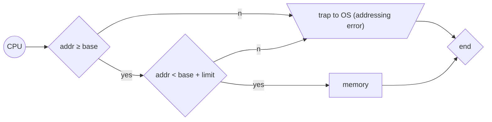

# Hardware protection

## Why?

Prevents user programs to break computer by executing bad instructions

## Dual-Mode Operation

- User mode : may disable some instructions (cannot execute privileged instructions)
- Kernel mode (Monitor mode) : can execute all instructions
- Uses a bit to indicate current mode

!!! example "User mode vs Kernel mode applications"

    - User mode
        - Games
        - Browser
    - Kernel mode
        - Drivers
        - File system
        - Memory manager
        - Kernel level anticheat (done by writing drivers, for example)

## IO protection

- All IO instructions are privileged instructions

> Because IO device is shared between users

But still can modify memory to do something bad

## Memory protection

- Protect interrupt vector and the interrupt service routines

### HW support

- Base register : smallest leagal physical memory address
- Limit register : contains the size of the range

Outside of the range is protected

## CPU protection

- Prevent user program from not returning control

### HW support

- Timer: interrupts computer after specified period
- Timer reaches $0$ an interrupt occurs

> Implement time sharing

- *Load-timer* is a privileged instruction, it writes the timer value

## FAQ

- Is ... instruction a privileged instruction?
