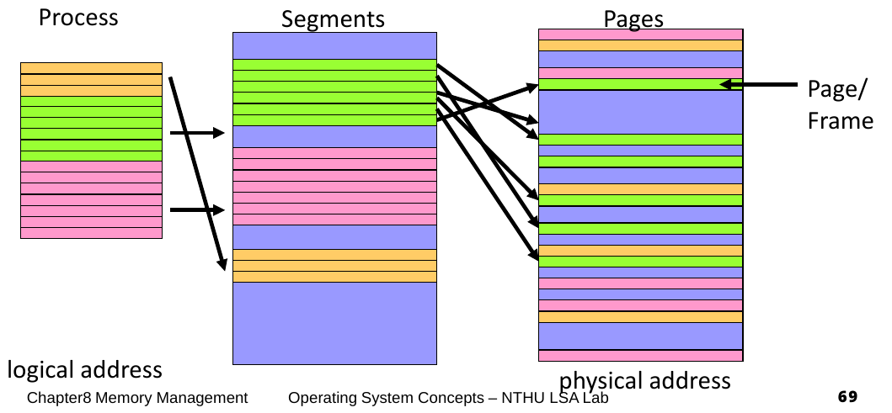
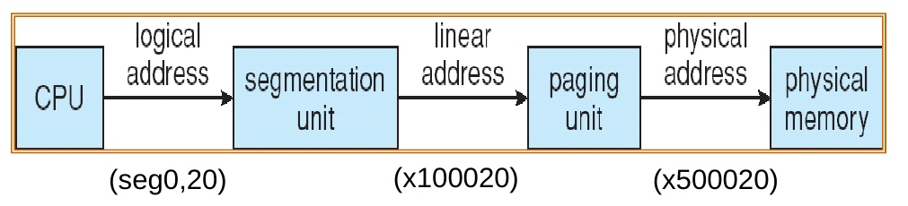
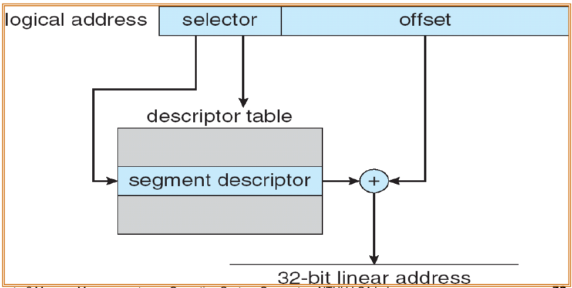
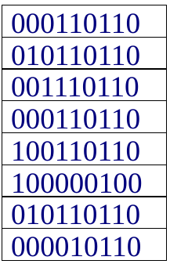
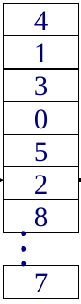

# Segmentation

- Segments are a logical unit such as
    - main program
    - function, object

## Segmentation table

- Logical address (seg#, offset)
    - Offset has the same length as physical address

- **Segmentation table**, each entry has
    - Base : start of physical address
    - Limit : the length of the segment

- Segment-table bse register (STBR): the physical address of the segmentation table
- Segement-table length register (STLR): the number of segments

### Segmentation hardware

- Limit register is used to check offset length
- MMU allocate memory by assigning an appropriate base address for each segment

## Protection and Sharing

- Protection bits associated with segments
    - Readonly segment (code)
    - Read-write segments (data,heap,stack)

- Code sharing occurs at **segment level** 
    - **Shared memory communication** 
    - **Shared library**

## Segmentation with Paging

- Apply **segmentation** in logical address space 
- Apply **paging** in physical address space

### Address Translation

## Segmentation calculations

### Linear address to physical address

 

!!! example
    
    - Physical memory size: 512 B
    - Page size: 32 B
    - Logical address can have 8 segments

    Given a 12 bits logical address `0x448`, page and segment tables, translate it to address physical address

    !!! note "tables"

        |Segment table| Page table |
        |:---:|:---:|
        |||

    ??? abstract "Solution"
        
        - Segment offset = $\log_2(\text{#segments})=3$ bits
        - Page number = $\log_2(\text{#pages})=\log_2\left(\dfrac{2^9}{2^5}\right)=4$ bits
        - `0x448` is `010001001000` in binary
        - <u>010</u><u>001001000</u> `010` is segment offset, so we take `001110110` and add `001001000` to it
        - ***Linear address*** `001110110+001001000=010111110`.
        - First $4$ bits is page offset, so the page number is $2$
        - Page offset is the remaining bits in linear address, i.e., `11110`
        - Physical address is `{page number}{page offset}={0010}{11110}`

### IMPORTANT NOTES ON NAMING
!!! note
    
    - Page offset的意思是***page裡面***要讀哪個word
    - Segment offset是拿來和Segment table裡面的值相加得到Linear address的
    - XXX number是要讀***XXX table裡面***第幾個XXX
    

