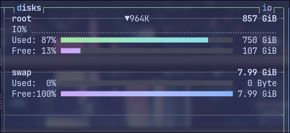

# Swapping

[Swap - ArchWiki](https://wiki.archlinux.org/title/Swap)





## Backing store

- A chunk of disk **separated from file system**


=== "bash"
```bash
# While installing arch linux, if you want to enable swap, which you should, you have to do

mkswap /dev/sdXy
swapon /dev/sdXy

# so that the system knows you want to make the partition /dev/sdXy the swap space
# Clearly, this is separated from the file system.
```


## Why?


> Because

- Swap lower priority process with a higher one


!!! note

    - A process to be swapped **must be idle**, or the io device will write to memory, and the image is then broken on disk
    - IO operations are done through OS buffers (a memory space belongs to no user processes)

## Bottleneck

- The bottleneck is the transfer time, because disk is slow

> How to swap efficiently?
