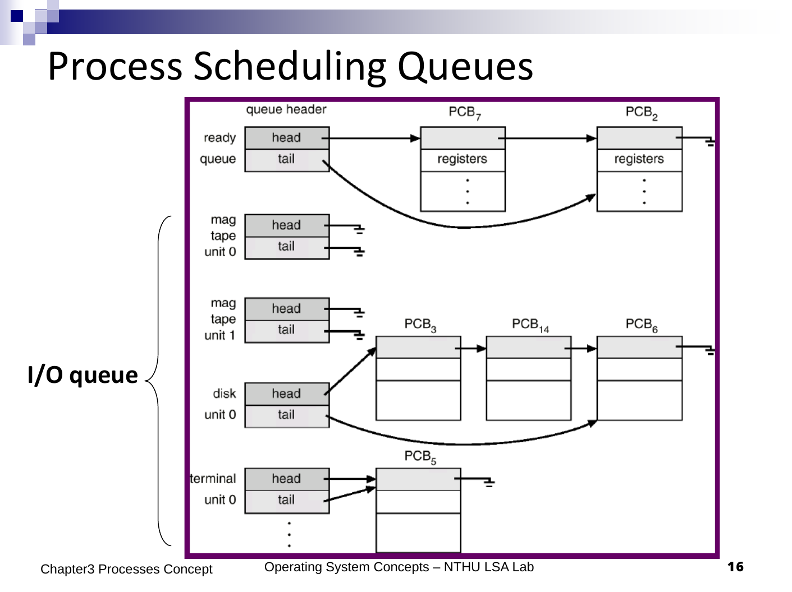
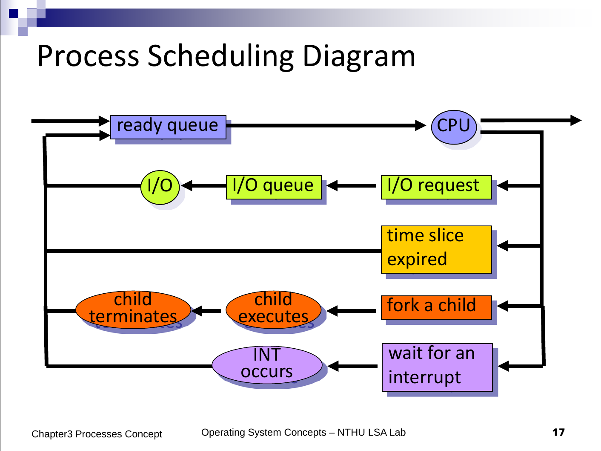

# Process Scheduling

- Multiprogramming : maximize CPU utilization

- Time sharing: users can interact with each program while it is running

## Process Scheduling Queues

- Job queue : all processes
- Ready queue : all ready to executte
- Device queue : waiting for an IO device

??? example "Examples"
    
    
    

## Schedulers

- *Short-term* scheduler (**CPU scheduler**) : (Ready state $\to$ Run state)
- *Long-term* scheduler (**job scheduler**) : (New state $\to$ Ready state)
- *Medium-term* scheduler : **swapped in/out memory** (Ready state $\to$ wait state) (**swap**)

### Long-term scheduler

- Control *degree of multiprogramming*
- Execute less frequently (once several minutes)
- Select a *good mix of CPU-bound & IO-bound*
- UNIX/NT : no long-term scheduler
    - created process placed in memory for short-term scheduler
    - Multiprogramming degree is bounded by hardware limitations

### Short-term scheduler

- Execute quite frequently (*once per 100ms*)
- Must be efficient

### Medium-term scheduler

- **swap out** : remove from memory
- **swap in** : fetch from swap

- improve process mix, free up memory

- Related to virtual memory

