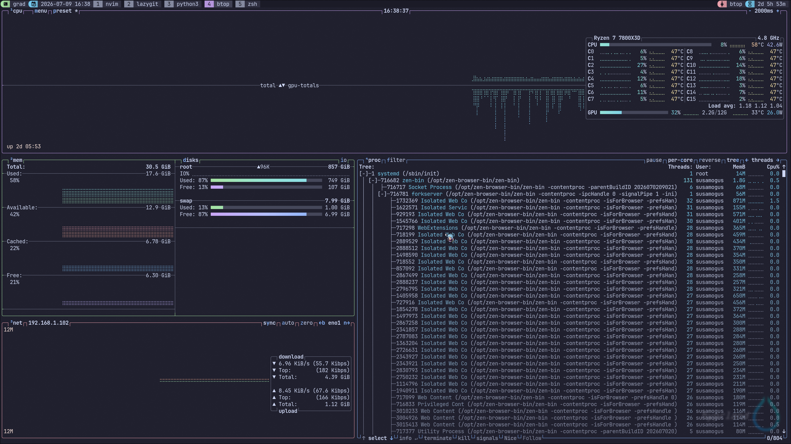

# Process

- Program is passive, a binary code
- Process is active, a program that is executing in **memory**


!!! definition "Process"

    A process includes:

    - *Code* (machine code)
    - *Data section*
    - *Stack*
    - *Heap*
    - *Program counter*
    - Associated *resources*


## Threads


- Threads belong to the same process share

Every processes are called threads on linux!!




## Process States

!!! definition "States"
    - *New*: process is being created
    - *Ready*: the process is in the memory waiting to be assigned to a processor
    - *Running*: executing
    - *Waiting*: waiting for events to occur
    - *Terminated*: terminated

## Process Control Block (PCV)

> Created by OS

!!! definition "PCB"
    - *Process state*
    - *PC*
    - *CPU registers*
    - Scheduling info
    - Memory management info
    - IO status
    - Accounting info


## Context switch

!!! definition "Context switch"

    把現在在執行的`process 0`的state存在`PCB0`，然後把另一個需要被執行的`process 1`的`PCB1`讀出來


!!! problem

    在Context switch的時候CPU是idle的，而且因為要分享資源所以是必須的

??? example "Solution"

    - 提高memory speed
    - 加更多register
    - 用一個instruction把所有的register存好
    - *multiple sets of registers*


## Process Creation

### Resource sharing

Maybe:

- Parent and child share all resources
- Child process shares subset of parent's resources
- Parent and child share no resources

### Execution

- Parent and children execute concurrently
- Parent waits until children terminate

### Address space

- Child duplicate of parent, communication via sharing variables
- Child has a program loaded into it, communication via message passing


## UNIX/Linux Process Creation


### fork

- Create a new child process
- Child duplicates the address space of its parent
- Child and parent execute concurrently after fork
- Child: return value of fork is `0`
- Parent: return value of fork is `PID` of the child 

    

### execlp

- Load a new binary file, destroying the old code

### wait

- Parent waits for one of its child process to complete


!!! example 

    ```C
    
    #include <stdio.h>
    #include <unistd.h>

    void main() {
    int pid = fork();
    if (pid == 0)
        printf("Child pid = %d\n", pid);
    else
        printf("Parent pid = %d\n", pid);
    return;
    }

    ```
## Process termination


- Terminates when the last statement is executed or exit() is called
- All resources of process includeing physical & virtual memory, open files, IO buffers are deallocated by the OS

- Parent can terminate execution of children processes by specifying its pid

> Killing parent kills all its children


