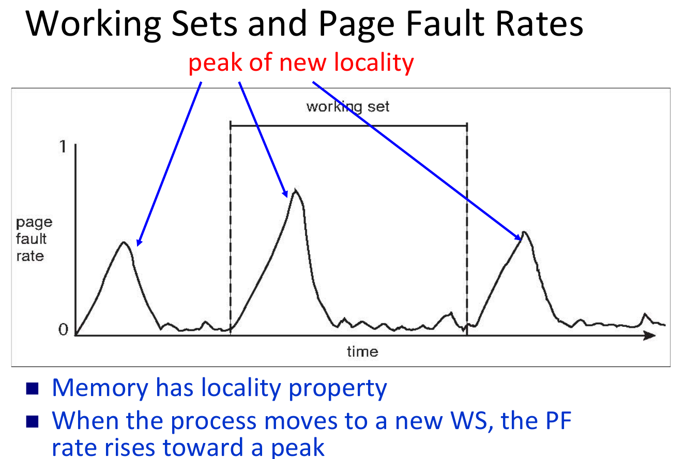

# Thrashing

!!! definition "Thrashing"

    - A process is thrashing if it is spending more time paging than executing

## Why Thrashing Happens

Assume global replacement is used

- Process queued for IO to swap (page fault)
    1. **Low CPU utilization**
    2. OS increases the degree of multiprogramming
    3. new processes take frames from old processes
    4. more page faults and thus more IO

To prevent thrashing, must provide enough frames for each process

### Working-Set Model

算Process最近總共用了幾個page，叫做Working-Set，然後把所有的process的Working set size加起來得到D，設$m$是所有可用的frames

$D>m$那麼就會thrashing，所以得殺掉一些人

$D<<m$那就一堆frame沒用到，可以把degree of MP增加

> Minecraft once said : 太貴了！

### Page-fault Frequency

- Directly measures and controls the page fault rate to prevent thrashing

- Establish upper and lower bounds on the desired page-fault rate of a process
    - If page fault rate exceeds the upper bound then allocate more frames
    - If lower then remove some frames

!!! note "Comparaison of Working-Set and Page-fault"

     
